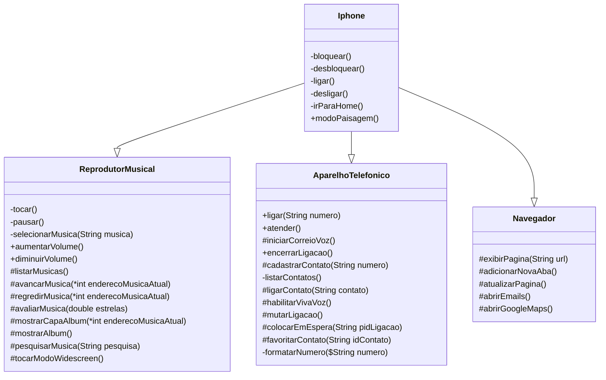

## MODELAGEM DE IPHONE
##### Apresentação Steve Jobs 2007

```mermaid
classDiagram
    Iphone --|> ReprodutorMusical
    Iphone --|> AparelhoTelefonico
    Iphone --|> Navegador

    class Iphone{
        -bloquear()
        -desbloquear()
        -ligar()
        -desligar()
        -irParaHome()
        +modoPaisagem()

    }
    class ReprodutorMusical{
        -tocar()
        -pausar()
        -selecionarMusica(String musica)
        +aumentarVolume()
        +diminuirVolume()
        #listarMusicas()
        #avancarMusica(*int enderecoMusicaAtual)
        #regredirMusica(*int enderecoMusicaAtual)
        #avaliarMusica(double estrelas)
        #mostrarCapaAlbum(*int enderecoMusicaAtual)
        #mostrarAlbum()
        #pesquisarMusica(String pesquisa)
        #tocarModoWidescreen()
      
    }
    class AparelhoTelefonico{
        +ligar(String numero)
        +atender()
        #iniciarCorreioVoz()
        +encerrarLigacao()
        #cadastrarContato(String numero)
        -listarContatos()
        #ligarContato(String contato)
        #habilitarVivaVoz()
        #mutarLigacao()
        #colocarEmEspera(String pidLigacao)
        #favoritarContato(String idContato)
        -formatarNumero($String numero)
      
    }
    class Navegador{
        #exibirPagina(String url)
        #adicionarNovaAba()
        #atualizarPagina()
        #abrirEmails()
        #abrirGoogleMaps()
    
    }

```

#### Diagrma feito no Mermaid

